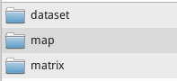
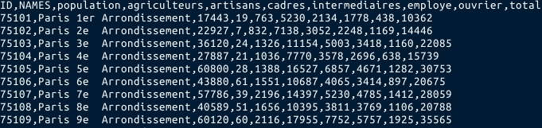
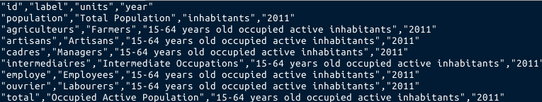

# Une plateforme de calcul et de visualisation d'indicateurs fonctionnels 
_**Compute and Display Functionnal Indicators**_


**Démo de l'application [ICI](http://www.ums-riate.fr/funci/)**


## Objectif de l'application  
Les organisations, les chercheurs et les praticiens travaillent principalement sur des données « statiques »
qui caractérisent des unités spatiales. Dans ce cadre, chaque valeur décrit une unité spatiale
indépendamment de son contexte et des infrastructures qui la traversent. Les indicateurs fonctionnels aident
à considérer chaque unité spatiale dans son contexte territorial.  
Func-i est un outil qui répond à un double objectif :  
1. offrir une plateforme de calcul et de visualisation d'indicateurs fonctionnels ;  
2. proposer un outil générique que d’autres utilisateurs peuvent s’approprier et développer sur leurs
propres données.  

## Principe
Les modèles d’interaction spatiale sont utilisés pour décrire, expliquer ou prévoir les interactions entre les
lieux. On distingue deux grandes familles de modèles : l’interaction peut être saisie à travers des flux entre
les lieux (flux de personnes, de marchandises, de richesse, d’information, etc.) ; l’interaction peut aussi être
saisie à travers l’influence exercée par un lieu sur tous les autres (aire de marché d’un commerce, aire
d’influence d’une ville, etc.). C'est ce second type de modèle qui est mobilisé dans la plateforme Func-i. Plus
précisément, le potentiel, concept développé par le physicien John Q. Stewart , permet de mesurer les
stocks (quantités brutes de population, de travailleurs, de production) situés autour d'un lieu selon une
distance donnée (exprimée en temps de transport ou simplement à vol d’oiseau).
Selon ce principe, les indicateurs fonctionnels permettent :  
1. de rendre les cartes plus intelligibles en simplifiant la représentation des phénomènes spatiaux (figure 1);  
2. d’enrichir l’information en considérant simultanément les problématiques d’accessibilité et les
caractéristiques régionales.  

## Description
La plateforme se compose de trois principaux onglets. Le premier (**maps**), permet de visualiser sur une
carte, le potentiel ou l’accessibilité d’une série d’indicateurs statistiques (e.g. population, agriculteurs,
ouvriers, ...) . Dans le menu, les fonctions d’interactions sont paramétrables. Il est possible d’y faire varier la
portée et la nature de l’interaction elle-même (distance à vol d’oiseau, temps de transport par la route,
etc...). La modification de ces paramètres permet alors de construire des représentations cartographiques
plus ou moins simplifiées. Sous le menu, un texte d’explication est généré donnant une clef de lecture
concernant la carte affichée à l’écran. Sous la carte sont listées les 10 unités territoriales les plus
accessibles selon les paramètres choisis par l’utilisateur. Deux boutons permettent d’exporter les données et
la carte dans différents formats (csv, svg, png, jpg, pdf).  
  
Si la cartographie de répartition du nombre d’ouvriers à l’échelle des communes d’Ile-de-France ne donne
pas immédiatement une image intelligible et mémorisable , l’enrichissement de la donnée par l’accessibilité
permet aussitôt d’en dégager les grandes structures spatiales. Ainsi, sur la figure 1, Paris et la petite
couronne sont naturellement mis en exergue. Mais, la carte d’accessibilité permet ici également de visualiser
de façon très nette d’autres pôles urbains secondaires où se concentrent des populations ouvrières :
Trappes, Goussainville, Mantes-la-Jolie, Evry, Meaux, Melun, les Mureaux, Cergy, ...  

L’onglet **graphs** permet de comparer les unités territoriales entre-elles pour un indicateur donné que
l’utilisateur peut changer à tout moment. Enfin, l’onglet **Help** décrit les éléments méthodologiques.

## Contexte de développement
L’application a été réalisée dans un premier temps dans le cadre du projet européen [ESPON FIT](http://fit.espon.eu/). Dans un second temps, dans une démarche de reproductibilité et d’ouverture du code,
l’outil a été rendu générique pour permettre son utilisation par d’autres utilisateurs sur d’autres espaces
géographiques avec d’autres données. 
La cartographie des CSP en Île-de-France est donc un
exemple d’utilisation parmi d’autres : la plateforme Func-i est une plateforme applicable à tout jeu de
données spatialisées.

## Technologies mobilisées
Func-i s’appuie sur deux environnements techniques différents. Tout d’abord, les indicateurs d’accessibilité
sont calculés en « backoffice » grâce au langage R et au package SpatialPosition (sur le [CRAN](https://cran.r-project.org/web/packages/SpatialPosition/) et sur [GitHub](Groupe-ElementR/SpatialPosition
)) . Ceci permet de générer
en bloc tous les fichiers utilisés par l’application. L’interface du site, les cartes et les graphiques sont quant à
eux générés dynamiquement via les langages usuels mis en œuvre dans le développement web (PHP,
HTML5, CSS, JavaScript). Deux librairies JavaScript sont également utilisées : Highcharts et JQuery. Du
fait de ces choix technique, l’application est portable, elle ne nécessite pas de base de données.


## Instruction d'installation 

### Préparation des données  
Les données en entrée doivent être correctement structurées et formatées.   

Un dossier **input** doit être construit de la manière suivante :  
   
Le dossier dataset doit contenir un fichier **data.csv** contenant les données et un dossier **metadata.csv** décrivant ces données.   

Le fichier **data.csv** doit être construit de la manière suivante :  
   
C'est à dire un champs "ID", un champs "NAMES" suivit des variables de stock à transformer.   

Le fichier **metadata.csv** doit être construit de la manière suivante :  
   
L'identifiant des champs doit être le même que dans le fichier **data.csv**.  

Le dossier **map** doit contenir un shapefile de polygones correspondant aux régions du fichier **data.csv**. L'identifiant et unique champs de la table attributaire du shapefile doit être nommé "ID".  

Il est possible d'importer des mesures de distances entre régions. Il faut placer ces fichiers dans le dossier **matrix**.  


### Dans R...

- Sourcer les fonctions R
```{r}
source("/funci_pgm.R")
```

- Choisir les dossier d'import et d'export  
```{r}
input <- "input_idf"
output <- "output_idf"
```
- Créer les répertoires de sortie  
```{r}
createFolders(output = output)
```
- Import des données de stocks et des metadonnées  
```{r}
myspdf <- importData(input = input)
mydfmetadata <- importMetaData(input = input)
```
- Création d'une matrice de distances euclidiennes entre les régions  
```{r}
mymat <- CreateDistMatrix(knownpts = myspdf, unknownpts = myspdf,
                          longlat = FALSE, bypassctrl = FALSE)
```
- Création des fichiers nécessaire à la conception des graphiques interactifs  
```{r}
createGraph(output = output, myspdf = myspdf)
```
- Export de la nomenclature des unités et du fond de carte  
```{r}
exportNomenclatureAndMap(output = output, myspdf = myspdf)
```
- Calcul des indicateurs fonctionnels  
Cette étape est importante, c'est ici que l'on définit les paramètres des indicateurs fonctionnels calculés.  
aParams concerne les mesures d'accessibilité et pParams ceux de potentiels.
```{r}
computeVal(indParams = mydfmetadata, myspdf = myspdf, mymat = mymat,
           dmode = "AsTheCrowFlies",
           aParams = c(0.005, 0.01, 0.05),
           pParams =  c(0,2500,5000,7500,10000),
           seqSpans = c(0, seq(2500, 50000, 2500)))
```
- Création du fichier de paramètre
```{r}
x1 <- list(dmode = "AsTheCrowFlies", label = "Euclidean Distance",
           pParams =  c(0,2500,5000,7500,10000), order = 1,
           units = "meters")
createParams(output = output, mydfmetadata = mydfmetadata,
             aParams = c(0.005, 0.01, 0.05),
             matlist = list(x1))
```


### Déployer l'application
A la suite de ces opérations le dossier **output_idf** doit être renomé **resources** et placé dans le dossier **funci_app**.   
Le dossier **funci_app** doit être mis sur un serveur et l'application est disponible!

## Licence & Avertissement
Func-i est un logiciel libre livré sans AUCUNE GARANTIE.  
Vous pouvez le redistribuer sous certaines conditions.  
Ce logiciel est sous licence GNU General Public License, version 2 ou 3.   
Le fichier LICENSE explicite les termes de la licence. 

